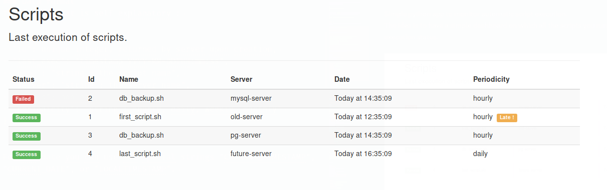

# Scripto

Simple python app to monitor automatic script execution.  
The idea is to have a simple dashboard on which all the scripts you run in your datacenter are represented with their execution status.



You can see the status of each script and its last execution time.  
I was fed up with getting tons of emails each day, and wanted something more syntetic.  
Through the REST API, any script can send its status, and the last execution date is used to see if something is wrong.

## Install & run
This server is written in python 3 and uses a simple sqlite database for persistance.  
Use pip to install the dependencies of the project, then run the server :
```
pip install -r pip-packages.txt
```

For development or test, run the server and the sqlite database will be automaticaly created :

```
$ python scripto_dev_server.py
```

There is also a `uwsgi` version that can be served by nginx for example ([nginx config example](./docs/nginx/scripto.conf))
```
$ uwsgi --socket 127.0.0.1:8080 -w scripto_wsgi:appuwsgi --socket 127.0.0.1:8080 -w scripto_wsgi:app
```

## REST API
You can use the REST api of the server to send the status of your scripts.

The main endpoint is `/api/v1/script`

### Data format
The json format is self explanatory :
```
{
  "id": unique integer, returned by server upon creation,
  "last_exec": "timestamp YYYY-MM-DDTHH:mm:ss",
  "name": "string : the script name",
  "server": "string : the server name",
  "status": boolean
}
```

For the date you can use the special strings "CURRENT_TIMESTAMP", "CURRENT_DATE", or "LOCALTIMESTAMP".

example :
```json
POST /api/v1/script HTTP/1.1
Host: example.com

{
  "last_exec": "CURRENT_TIMESTAMP",
  "name": "test.sh",
  "server": "myserver.local",
  "status": true
}
```
Response :
```json
HTTP/1.0 201 CREATED

{
  "id": 1,
  "last_exec": "2017-08-02T14:16:25",
  "name": "test.sh",
  "server": "myserver.local",
  "status": true
}
```


### Curl examples
You need to specify the json content type in your HTTP Headers for the server to accept your data.

#### Creation, use POST
Run :
```bash
$ curl -i -H "Content-Type: application/json" -XPOST http://localhost:5000/api/v1/script -d '{"last_exec":"CURRENT_TIMESTAMP", "name": "test_curl.sh", "server": "'$HOST'", "status": 0}'
```

to get the response

```json
HTTP/1.0 201 CREATED
Content-Type: application/json
Location: http://localhost:5000/api/v1/script/5
Vary: Accept
Content-Type: application/json
Content-Length: 140
Server: Werkzeug/0.12.2 Python/3.6.1
Date: Wed, 02 Aug 2017 14:16:25 GMT

{
  "id": 5,
  "last_exec": "2017-08-02T14:16:25",
  "name": "test_curl.sh",
  "server": "myserver.local",
  "status": false
}
```

#### Update, get the id previously returned and use PUT

```
$  curl -i -H "Content-Type: application/json" -XPUT http://localhost:5000/api/v1/script/5 -d '{"last_exec":"CURRENT_TIMESTAMP", "name": "test_curl.sh", "server": "'$HOST'", "status": 1}'
```

Response :

```json
HTTP/1.0 200 OK
Content-Type: application/json
Vary: Accept
Content-Type: application/json
Content-Length: 130
Server: Werkzeug/0.12.2 Python/3.6.1
Date: Wed, 02 Aug 2017 15:10:45 GMT

{
  "id": 5,
  "last_exec": "2017-08-02T15:10:45",
  "name": "test_curl.sh",
  "server": "myserver.local",
  "status": true
}
```

#### DELETE
```bash
$ curl -i -H "Content-Type: application/json" -XDELETE http://localhost:5000/api/v1/script/5
```

Response :
```
HTTP/1.0 204 NO CONTENT
Content-Type: application/json
Vary: Accept
Content-Type: application/json
Content-Length: 0
Server: Werkzeug/0.12.2 Python/3.6.1
Date: Wed, 02 Aug 2017 15:09:50 GMT
```

### Python example

Simple example using the [requests](http://docs.python-requests.org/en/master/)
module to send the status to scripto

```python
#!/usr/bin/python3

from platform import node
import requests

status = False
scripto_id = 1

data = {'last_exec': 'CURRENT_TIMESTAMP',
        'name': __file__,
        'server': node(),
        'status': status}
scripto_url = 'http://scripto.domain.tld/api/v1/script/{}'.format(scripto_id)

r = requests.put(scripto_url, json=data)
if r.status_code != 200:
    print('Could not send status to scripto')
```
## TODO list

-   Order the script view table by status
-   Allow to order the script view table by execution Date
-   Add a periodicity to script (hourly, daily, weekly, monthly), allowing to emit a warning if a script has not been launched for a moment
-   Implement the PATCH method
-   Example client code in python
-   Script shell to encapsulate the API call (ie. `scriptosend --id <id> --name <scriptname> --status <1|0>`), this script could be configured and deployed on any server via ansible for example
